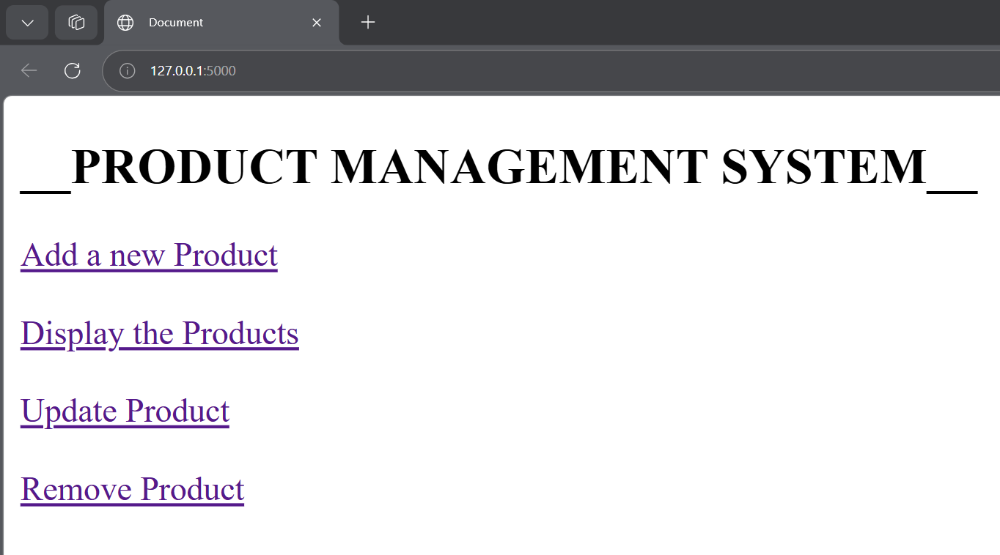
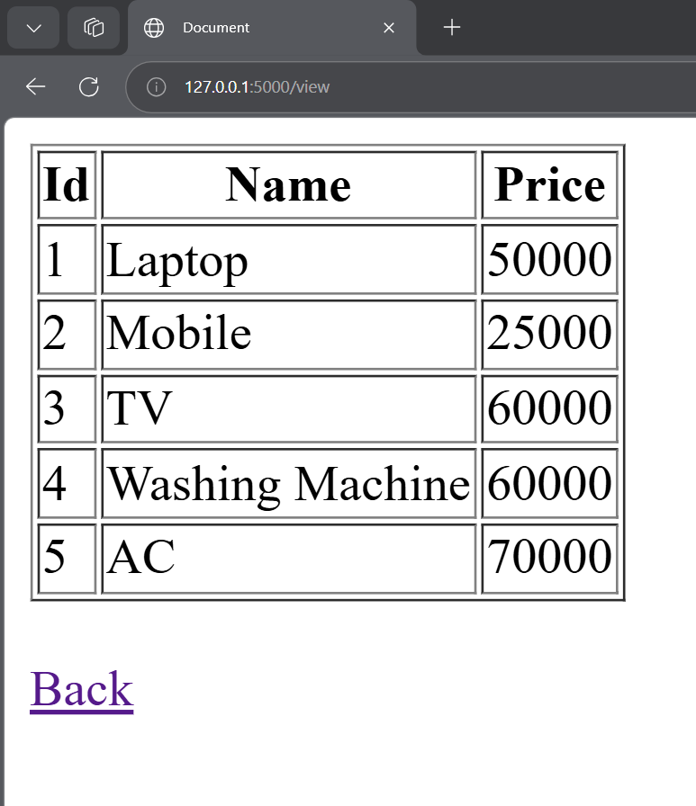
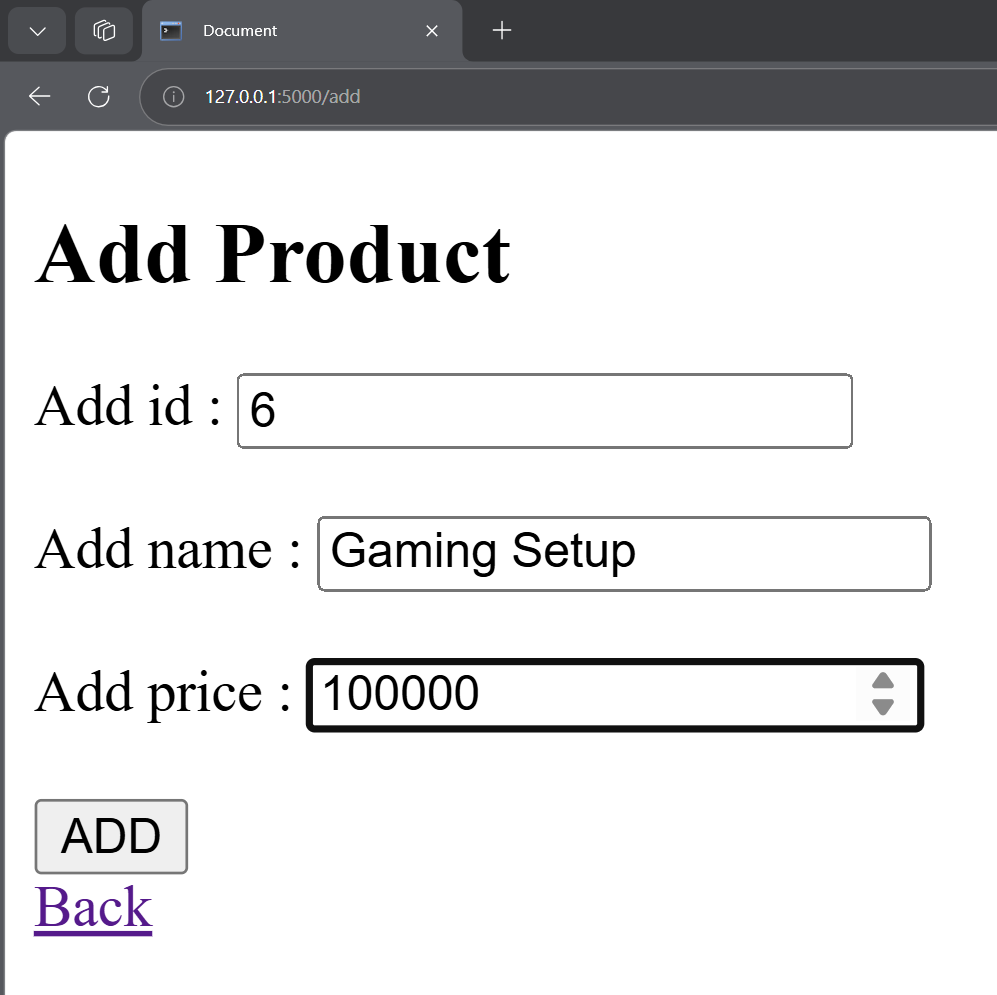
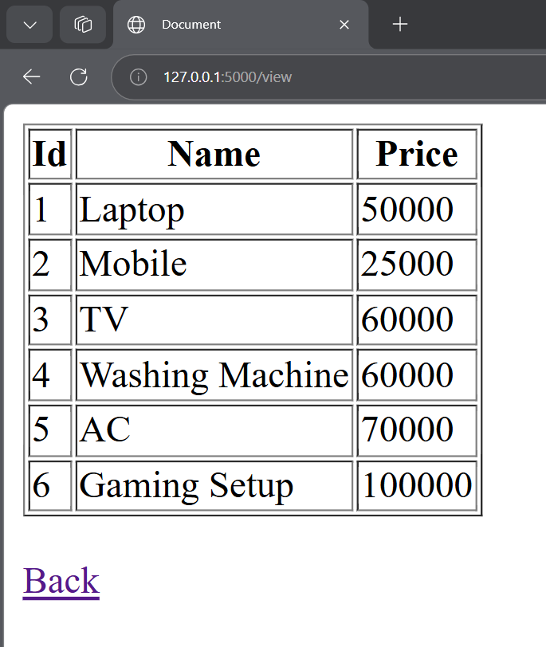
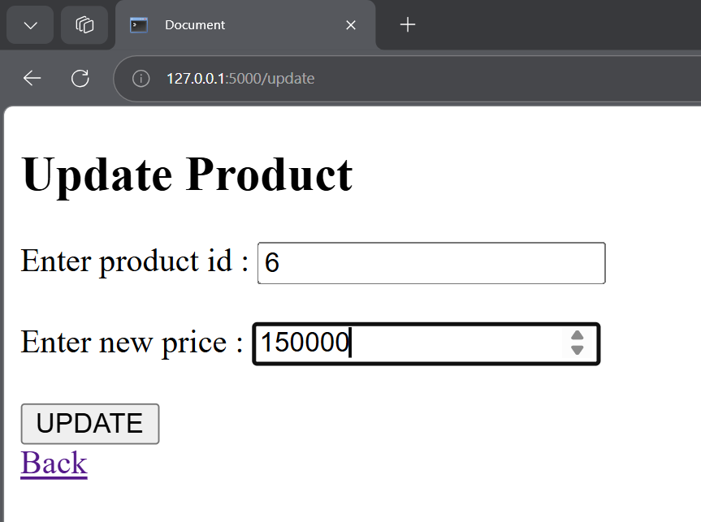
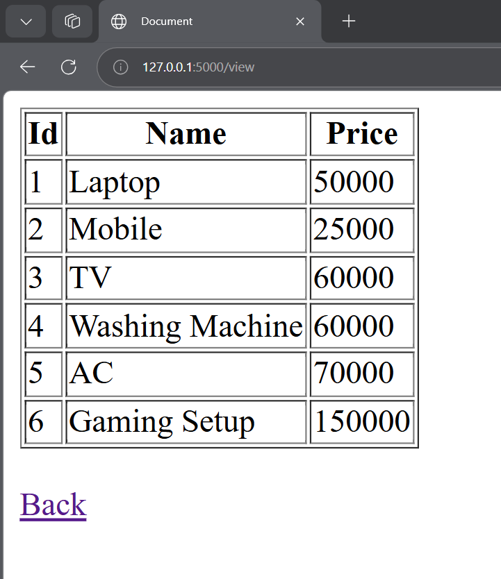
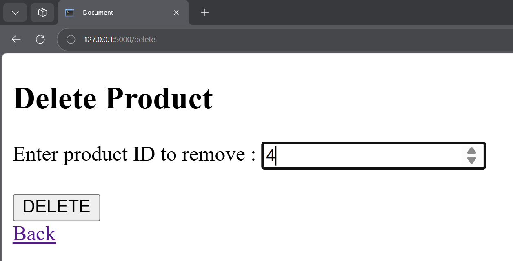
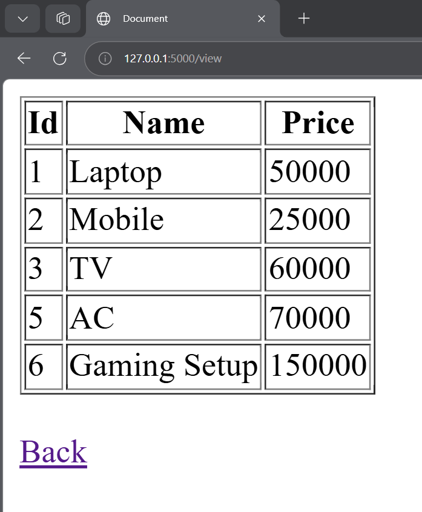

# 📦 Product Management System (PMS)

A lightweight CRUD application built with Python and Flask to manage inventory efficiently.

---

## 📸 Visual Walkthrough

### 🖥️ Main Dashboard
Access all management features from a central hub.

### 📊 Inventory Overview
View the current list of products and their prices.

### ➕ Adding Products
Seamlessly add new items to the system.

### ✏️ Updating Records
Update product pricing in real-time.

### ❌ Removing Items
Delete products from the database via unique ID.

---

## 🚀 How to Run
1. Ensure you have Python installed.
2. Navigate to the `codes` directory.
3. Run `python test.py`.
